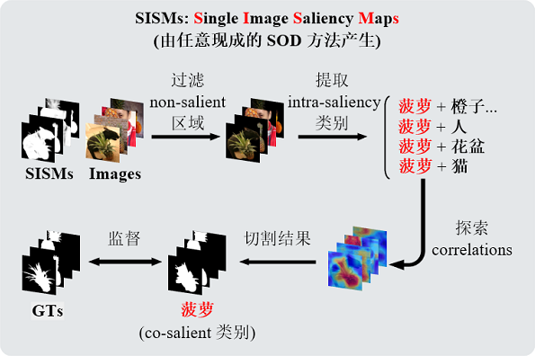

# **ICNet: Intra-saliency Correlation Network for Co-Saliency Detection**

This repository is the official PyTorch implementation of our *NeurIPS(2020)* paper.

We will update this page as soon as possible.

## Training Datasets

**Our training set is a subset of the *COCO* dataset, containing 9213 images.**

* ***COCO9213-os.zip*** (images with original size, 4.53GB), [GoogleDrive](https://drive.google.com/file/d/1fOfSX_CtWizDapB0OeTJxAydL2yDOP5H/view?usp=sharing) | [BaiduYun](https://pan.baidu.com/s/1wOxdP6EQEqMwjg3_v1z2-A) (fetch code: 5183).

* ***COCO9213.zip*** (images resized to 224*224, 943MB), [GoogleDrive](https://drive.google.com/file/d/1GbA_WKvJm04Z1tR8pTSzBdYVQ75avg4f/view?usp=sharing) | [BaiduYun](https://pan.baidu.com/s/1r-qCLeG3L6i-OrBfKrXANg) (fetch code: 8d7z).

## Test Datasets

**Used in our paper:**

* ***MSRC***		''Object Categorization by Learned Universal Visual Dictionary, *ICCV(2005)*''

* ***iCoseg***		''iCoseg: Interactive Co-segmentation with Intelligent Scribble Guidance, *CVPR(2010)*''

* ***Cosal2015***	''Detection of Co-salient Objects by Looking Deep and Wide, *IJCV(2016)*''

You can download them from: [GoogleDrive](https://drive.google.com/file/d/1fvXvSwiJ5VGk-DuSHJxTw1xsi90FGuAL/view?usp=sharing) | [BaiduYun](https://pan.baidu.com/s/14VXYWO8doyppbonBUyEPpw) (fetch code: g8r7).

**Released recently:**

* **[*CoSOD3k*](http://dpfan.net/CoSOD3K/)**	''Taking a Deeper Look at the Co-salient Object Detection, *CVPR(2020)*''

* **[*CoCA*](http://zhaozhang.net/coca.html)**		''Gradient-Induced Co-Saliency Detection, *ECCV(2020)*''

## Pre-trained Model

***ICNet_vgg16.pth*** (70MB), [GoogleDrive](https://drive.google.com/file/d/1wcT_XmwlshbLqCiJetmzQwi1ZNAzxiSU/view?usp=sharing) | [BaiduYun](https://pan.baidu.com/s/1__iiBcAI2S-Ns9MZnZwp8g) (fetch code: nkj9).

## Prediction Results

We release the co-saliency maps (predictions) generated by our ICNet on 5 benchmark datasets:

***MSRC***, ***iCoseg***, ***Cosal2015***, ***CoCA***, and ***CoSOD3k***.

***cosal-maps.zip*** (results of size 224*224, 20MB), [GoogleDrive](https://drive.google.com/file/d/1q9CAzPf5U3VPa_DGxzUGI_DANCuw_WEk/view?usp=sharing) | [BaiduYun](https://pan.baidu.com/s/1qbPJKMTiVStqjSGYWuqSgQ) (fetch code: du5e).

## Training, Test and Evaluation

*To be updated.*

## Compared Methods

We compare our ICNet with seven state-of-the-art Co-SOD methods:

* ***CBCS***		''Cluster-Based Co-Saliency Detection, *TIP(2013)*''​			  

* ***CSHS***		''Co-Saliency Detection Based on Hierarchical Segmentation, *SPL(2014)*''

* ***CoDW***		''Detection of Co-salient Objects by Looking Deep and Wide, *IJCV(2016)*''

* ***UCSG***		''Unsupervised CNN-based Co-Saliency Detection with Graphical Optimization, *ECCV(2018)*''

* ***CSMG***		''Co-saliency Detection via Mask-guided Fully Convolutional Networks with Multi-scale Label Smoothing, *CVPR(2019)*''

* ***MGLCN***		''A Unified Multiple Graph Learning and Convolutional Network Model for Co-saliency Estimation, *ACM MM(2019)*''

* ***GICD***		''Gradient-Induced Co-Saliency Detection, *ECCV(2020)*''

You can download predictions of these methods from: [GoogleDrive](https://drive.google.com/drive/folders/1qdXWZQ-fF-WaCF-rat0Da7vFrAIYsj09?usp=sharing) | [BaiduYun](https://pan.baidu.com/s/10vpubz39atkg2lz095QvSQ) (fetch code: s7pr).

## Citation

*To be updated.*

## Contact

If you have any questions, feel free to contact me (Wen-Da Jin) via jwd331@126.com, I will reply as soon as possible.